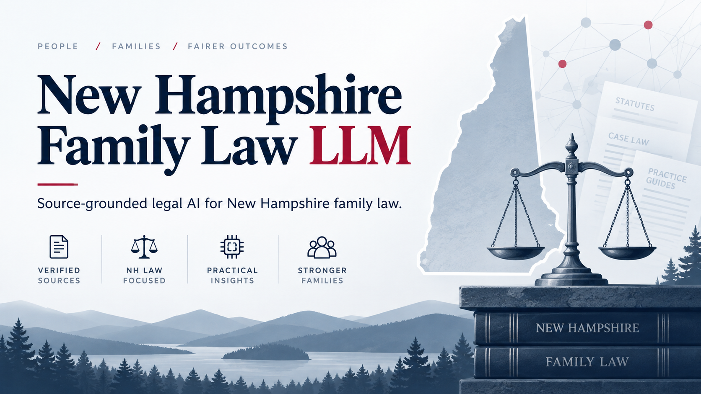

> **Current checkpoint: Pass 8 / 8.0.10.** See [README_FIRST.md](README_FIRST.md)
> and [the current evidence](docs/PASS_08_DESKTOP_INTEGRATION.md). Historical
> release claims below are not current Windows, legal-review or full-suite
> qualification. Four further passes are planned; release blockers remain.


# New Hampshire Family Law LLM



A source-grounded, review-required legal research workbench for **New Hampshire family law**. This repository is an independent New Hampshire adaptation of the open-source Maine Family Law LLM architecture. It is designed for retrieval-augmented research, citation checking, court-form workflows, and human-reviewed drafting—not autonomous legal advice.

> **Corpus status (2026-09-11):** Pass 4 contains 37 retrieval-eligible, section-scoped official-source capsules plus 2 future-effective pending overlays. It is a reviewed core snapshot, not exhaustive statewide acquisition. Court/DHHS original files and broad rule/case coverage remain pending.

## Core safeguards

- Prefer official primary sources: New Hampshire General Court, New Hampshire Judicial Branch, and New Hampshire state agencies.
- Store citation, issuing body, source URL, retrieval date, effective/amendment dates, status, and checksum with every authority.
- Rank `CURRENT_AUTHORITY` above `HISTORICAL_SUPERSEDED`; never silently blend superseded text into a current answer.
- Require pinpoint citations and quote-span verification for legal propositions.
- Label uncited, ambiguous, stale, or incomplete results and fail closed for consequential drafting.
- Treat generated calculations as worksheets for review, not binding child-support determinations.

## New Hampshire terminology

New Hampshire generally uses **parental rights and responsibilities**, **decision-making responsibility**, and **residential responsibility** rather than treating “custody” as the operative statutory vocabulary. Core chapters include RSA 461-A for parental rights and responsibilities and RSA 458-C for child-support guidelines. See [`docs/MAINE_TO_NH_CROSSWALK.md`](docs/MAINE_TO_NH_CROSSWALK.md).

## Repository map

- `corpus/manifest/` — machine-readable authority inventory in JSON, JSONL, and CSV.
- `corpus/PENDING_REVIEW/` — acquired snapshots awaiting effective-date review.
- `corpus/CURRENT_AUTHORITY/` — only reviewed, promoted current authority snapshots.
- `corpus/HISTORICAL_SUPERSEDED/` — explicitly segregated historical material.
- `config/nh_authority_sources.json` — official source catalog and acquisition queue.
- `scripts/collect_nh_authorities.py` — allowlisted downloader with provenance/checksums.
- `scripts/audit_nh_authorities.py` — coverage/currentness/legacy-authority audit.
- `prompts/nh_family_law_system.md` — source hierarchy and response guardrails.
- `docs/case_toolkit/` — generalized, non-identifying practical checklists.
- `assets/brand/` — New Hampshire visual identity.

## Quick start

Use the original application's normal setup command for its stack, then run the NH corpus checks:

```bash
python scripts/audit_nh_authorities.py
python scripts/verify_pass_04.py
python -m pytest tests/test_nh_authority_manifest.py tests/test_pass04_authority_snapshot.py -q
```

Preview an acquisition without downloading:

```bash
python scripts/collect_nh_authorities.py --dry-run
```

Acquire official source snapshots:

```bash
python scripts/collect_nh_authorities.py --download
python scripts/audit_nh_authorities.py
# Review each downloaded record, then promote it explicitly:
python scripts/promote_nh_authority.py NH-0001 --effective-date YYYY-MM-DD --reviewer NAME --notes "review basis"
```

## Legal and privacy notice

This software provides legal information and research support, not legal representation. Court orders remain binding unless modified by a tribunal with authority. Never use this project to hide income, evade support, violate a parenting order, harass another parent, or expose private family records. Do not commit client files, court records containing protected information, screenshots, credentials, or identifying family facts.

## Upstream provenance

Application architecture originated in `JTAHAI/maine-family-law-llm`. New Hampshire legal content, jurisdiction assumptions, branding, prompts, manifests, and update logic are maintained separately here. The Maine repository should remain independently usable and is not modified by this archive.


## NH legal-behavior engine

Pass 7 adds a synthetic 34-case New Hampshire legal-behavior regression suite and an NH-native `X-NHFL-*` transport namespace. Run `nhfl legal-eval --compact` to execute the engineering suite. Its results are review-required, non-filing-ready, not legal advice, and are not attorney-reviewed legal-quality evidence.

Pass 6 adds deterministic, source-gated issue spotting for parenting modification, child-support modification, court-versus-DHHS support authority, UCCJEA, and fail-closed UIFSA triage. Run `nhfl behavior --input examples/pass06_parenting_support_review.json`. The output is legal information, review-required, and never filing-ready by itself.
